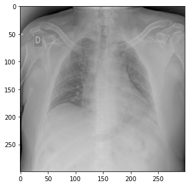
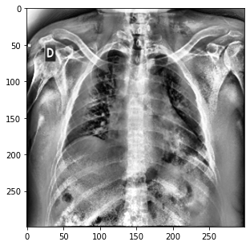
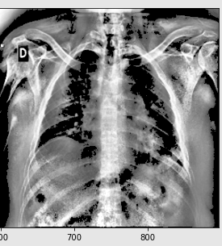
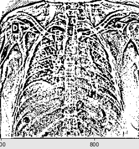
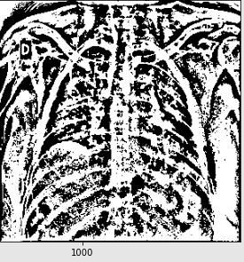

# Radiography Dataset.ipynb
Notebook with image exploration and dataset creation for model training.

# Radiography Classification.ipynb
Notebook with the construction of CNN and different approaches such as class balancing and image pre-processing in the creation of dataloaders.

## Results

### No pre-processing

- 0 = Covid
- 1 = Normal
- 2 = ViralPneumonia




``` 

                precision    recall  f1-score   support

           0       0.71      0.84      0.77        38
           1       0.95      0.91      0.93       139
           2       0.92      0.92      0.92        13

    accuracy                           0.89       190
   macro avg       0.86      0.89      0.87       190
weighted avg       0.90      0.89      0.90       190

array([[ 32,   6,   0],
       [ 12, 126,   1],
       [  1,   0,  12]])

``` 

### CLAHE Contrast Limited Adaptive Histogram Equalization

```
clahe=cv2.createCLAHE(clipLimit=40)
gray_img_clahe=clahe.apply(gray_img_eqhist)
```



``` 
                precision    recall  f1-score   support

           0       0.74      0.74      0.74        38
           1       0.93      0.94      0.93       139
           2       0.83      0.77      0.80        13

    accuracy                           0.88       190
   macro avg       0.83      0.81      0.82       190
weighted avg       0.88      0.88      0.88       190

array([[ 28,   9,   1],
       [  8, 130,   1],
       [  2,   1,  10]])

``` 

### THRESH_TOZERO

```
ret, img = cv2.threshold(img, th, max_val, cv2.THRESH_TOZERO)
``` 



``` 
                precision    recall  f1-score   support

           0       0.83      0.79      0.81        38
           1       0.94      0.96      0.95       139
           2       0.92      0.85      0.88        13

    accuracy                           0.92       190
   macro avg       0.90      0.86      0.88       190
weighted avg       0.91      0.92      0.91       190

array([[ 30,   8,   0],
       [  5, 133,   1],
       [  1,   1,  11]])
```


### ADAPTIVE_THRESH_GAUSSIAN 13, 5

```
cv2.adaptiveThreshold(img, 255, cv2.ADAPTIVE_THRESH_GAUSSIAN_C, cv2.THRESH_BINARY, 13, 5)
``` 



``` 

                precision    recall  f1-score   support

           0       0.88      0.95      0.91        38
           1       0.98      0.96      0.97       139
           2       0.85      0.85      0.85        13

    accuracy                           0.95       190
   macro avg       0.90      0.92      0.91       190
weighted avg       0.95      0.95      0.95       190


array([[ 36,   1,   1],
       [  5, 133,   1],
       [  0,   2,  11]])

``` 


### ADAPTIVE_THRESH_GAUSSIAN 31, 4

```
cv2.adaptiveThreshold(img, 255, cv2.ADAPTIVE_THRESH_GAUSSIAN_C, cv2.THRESH_BINARY, 31, 4)
``` 



``` 

                precision    recall  f1-score   support

           0       0.94      0.79      0.86        38
           1       0.94      0.98      0.96       139
           2       0.86      0.92      0.89        13

    accuracy                           0.94       190
   macro avg       0.91      0.90      0.90       190
weighted avg       0.94      0.94      0.94       190

array([[ 30,   7,   1],
       [  2, 136,   1],
       [  0,   1,  12]])

``` 
